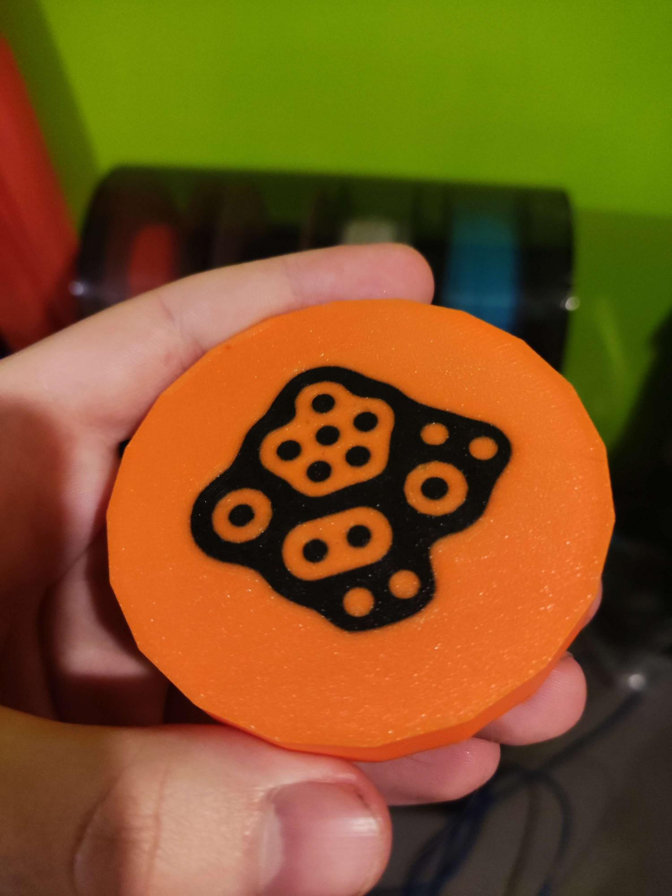

# Projet de la table

Projet de sandbox interactif dans un univers immersif sur plusieurs murs. Une table interactif serait en mesure de scanner les figurines pour changer des éléments dans le sandbox. Je m'occupe des figurines

# Prototype des figurines

## Testes effectués
Le prototpye des figurines dans le projet de la table. Les figurines seront scannées grâce à un symbole en dessous des figurines. Je voulais tester si j'étais capable de bien faire un modèle 3D pour ensuite l'imprimer en plusieurs couleurs et voir si le scanne marche avec les figurines.

## Méthodologie

J'ai créé un modèle 3D avec une bonne géométrie avec une face implémenté pour pouvoir séparer les deux pour avoir 2 couleurs différentes. Ensuite, grâce à mon frère, J'ai imprimé le modèle 3D importé en obj avec du plastique PLA. 

## Résultat

Le résultat était bien précis pour la séparation de couleurs et très résistant.

## Conclusion

J'ai réussi de faire mon idée de départ pour avoir un modèle imprimé grâce à mon modèle 3D et avoir une bonne séparation des couleurs pour avoir une précision lors du scanne.
